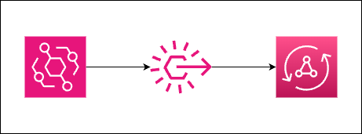

# Amazon EventBridge to AWS AppSync




On January 11, 2024, [Amazon EventBridge added AWS AppSync as a direct target](https://aws.amazon.com/about-aws/whats-new/2024/01/amazon-eventbridge-appsync-target-buses/). While the two could be tied together with an AWS Lambda function or as a direct API via an API Key, this solution provides a tighter and more scalable way of orchestrating data across applications.

This repository shows how to get a simple integration between the two where an event is put on a new event bus and an AppSync mutation is invoked.

> 🗒️ At the time of this repository creation, the L2 construct for EventBridge Rules does not support AppSync as a target. As such, we drop down to the L1 construct. This repository will be updated once the L2 construct is updated.

## Deploying this sample

After cloning this repository, install the dependencies with the following command:

```sh
npm i
```

From there, deploy the cdk project by running the following command:

```sh
npx aws-cdk deploy
```

or if using an AWS Profile:

```sh
npx aws-cdk deploy --profile your-profile-name
```

## Testing the event

Due to this process involving multiple services, it's easiest to test this out in the AWS console.

This repo is setup so that any event with a `source` value of `sample.source` will trigger the rule:

```ts
// lib/choreography/eventbridge.ts
eventPattern: {
			source: ['sample.source'],
		},
```

In addition, the AppSync API, expects a `msg` value to be passed:

```graphql
# lib/api/schema.graphql
type Mutation {
	publishMsgFromEB(msg: String!): String! @aws_iam
}
```

That means in the AWS Console, we can send a `msg` string in the `event.detail` section of our event, and check CloudWatch to verify the API was been triggered and the EventBridge message has been successfully passed.


